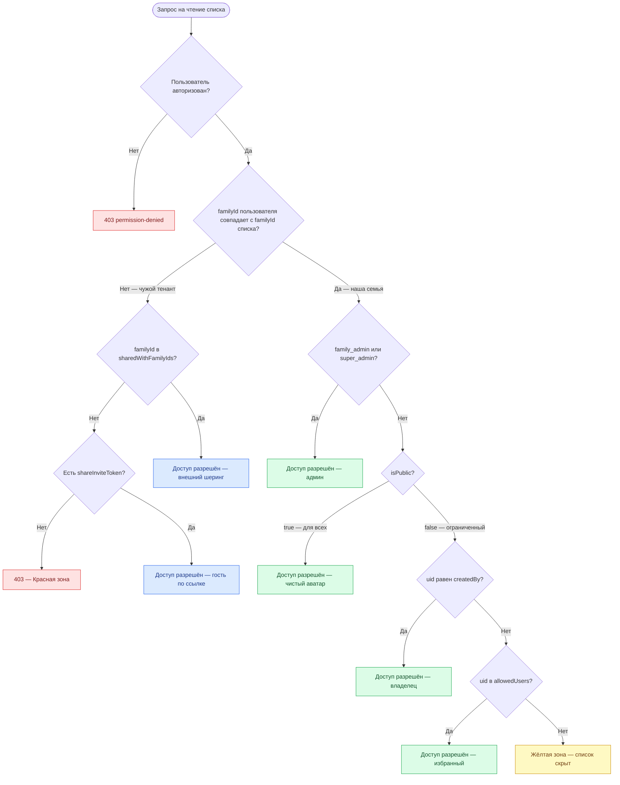

# ACCESS_MATRIX — матрица доступа к спискам

Этот документ описывает **матрицу изоляции данных** в BringHome на двух уровнях:

1. **Между семьями (тенантами)** — пользователь из `familyId` / `tenantId` одной семьи по умолчанию **не видит и не изменяет** списки другой семьи. Исключение — явный **внешний шеринг** (`sharedWithFamilyIds`) или активная **ссылка-приглашение** (`shareInviteToken`).
2. **Внутри одной семьи** — даже члены одной семьи могут быть **исключены** из конкретного списка, если у него ограниченный доступ (`isPublic: false` + `allowedUsers`).

> **Источник истины в коде:** `firestore.rules` → `canReadList`, `isExternalFamilyGuest`; UI-иконки — `ListHeaderOwnerAvatar.jsx`, фильтр на главной — `HomePage.jsx`.

| Термин в UI | Поле в Firestore | Значение |
|---|---|---|
| Tenant ID | `familyId` (legacy: `groupId`) | Идентификатор семьи-тенанта |
| Для всех | `isPublic: true` | Список виден всем членам семьи |
| Ограниченный 🔒 | `isPublic: false` | Только `createdBy`, `allowedUsers` и `family_admin` |
| Внешний шеринг 🔗 | `sharedWithFamilyIds[]` | Чтение (и items) для указанных чужих семей |

**Код ошибки:** Firestore возвращает `permission-denied` (эквивалент HTTP **403**).

---

## Граф принятия решения (Mermaid)

> **Если в Preview виден только код, а не схема:**
> 1. Установите расширение **Markdown Preview Mermaid Support** (`bierner.markdown-mermaid`) — Cursor предложит его через `.vscode/extensions.json`.
> 2. В проекте включено `"markdown.mermaid.enabled": true` в `.vscode/settings.json` — перезагрузите окно: `Cmd+Shift+P` → **Developer: Reload Window**, затем снова `Cmd+K V`.
> 3. **Гарантированный вариант:** откройте в браузере [`ACCESS_MATRIX.preview.html`](ACCESS_MATRIX.preview.html) (двойной клик по файлу в Finder или правый клик → Open with → Browser).



---

## Матрица истинности (примеры)

**Контекст тестовых семей:**

| Пользователь | UID | familyId | Роль |
|---|---|---|---|
| **Денис** | `denis` | `denis-family` | member, владелец списка |
| **Жена** | `wife` | `denis-family` | member |
| **Дочка** | `daughter` | `denis-family` | member |
| **Ричард** | `richard` | `richard-family` | member |

**Базовый список «Продукты»:** `familyId: denis-family`, `createdBy: denis`.

### A. Публичный список (`isPublic: true`)

| Пользователь | Тенант | Read | Write items | UI |
|---|---|---|---|---|
| Денис | Свой | ✅ | ✅ | Чистый аватар |
| Жена | Свой | ✅ | ✅ | Чистый аватар |
| Дочка | Свой | ✅ | ✅ | Чистый аватар |
| Ричард | Чужой | 🛑 403 | 🛑 403 | — |

### B. Ограниченный список (`isPublic: false`, `allowedUsers: [denis, wife]`)

| Пользователь | Тенант | Read | Write items | UI |
|---|---|---|---|---|
| Денис | Свой | ✅ | ✅ | 🔒 Владелец |
| Жена | Свой | ✅ | ✅ | 🔒 Избранная |
| Дочка | Свой | ⚠️ Скрыт | 🛑 403 | Жёлтая зона |
| Ричард | Чужой | 🛑 403 | 🛑 403 | Красная зона |

### C. Ограниченный + внешний шеринг (`sharedWithFamilyIds: [richard-family]`)

| Пользователь | Тенант | Read | Write items | Изменить список | UI |
|---|---|---|---|---|---|
| Денис | Свой | ✅ | ✅ | ✅ | 🔒 |
| Жена | Свой | ✅ | ✅ | ❌* | 🔒 |
| Дочка | Свой | ⚠️ Скрыт | 🛑 403 | 🛑 403 | Жёлтая зона |
| Ричард | Чужой (гость) | ✅ | ✅ | 🛑 403 | 🔗 Внешний гость |

\* Жена может менять только поля, разрешённые правилами (например, `viewedBy`), но не метаданные владельца.

Архив списка покупок: кнопка «Отправить в архив» в **настройках списка** (`CreateListSheet` mode=settings). Права: владелец, `admins[]`, `super_admin` (`canArchiveList`). Без прав — `ArchiveAccessModal` с контактами, кто может архивировать.

### D. Сводная таблица «кто видит что»

| Сценарий | Денис | Жена | Дочка | Ричард |
|---|---|---|---|---|
| Публичный, без шеринга | ✅ | ✅ | ✅ | 🛑 |
| Restricted `[denis, wife]` | ✅ 🔒 | ✅ 🔒 | ⚠️ | 🛑 |
| Restricted + external share | ✅ 🔒 | ✅ 🔒 | ⚠️ | ✅ 🔗 |
| Чужой список без шеринга | 🛑 | 🛑 | 🛑 | 🛑 |

**Легенда:** ✅ — доступ; 🛑 — `permission-denied` (403); ⚠️ — список не возвращается клиенту (скрыт на HomePage).

---

## Связанные автотесты

Правила покрыты интеграционными тестами:

```bash
npm run test   # Vitest + Firestore Emulator (нужна Java 11+)
```

Файл: `tests/firestore/listAccess.rules.test.js`

---

## Списки сборов (`packing_lists`)

Отдельная коллекция для поездок/шаблонов. Доступ:

| Условие | Read / Update items |
|---|---|
| `isPublic: true` (или нет поля `members` — legacy) в своей семье | ✅ |
| `isPublic: false` + `members: [uids]` | ✅ uid в `members` (в т.ч. из другой семьи) |
| `sharedWithFamilyIds` содержит семью зрителя | ✅ кросс-семейный гость |
| Активный `shareInviteToken` (чужой тенант, до join) | ✅ только чтение для принятия ссылки |
| `family_admin` / `super_admin` (своя семья) | ✅ |
| Чужой тенант без members / share | ❌ 403 |

Удаление — автор (своя семья) или `super_admin`.

Поле `members` — явный список uid с доступом; при тумблере «Для всей семьи» туда пишутся все члены семьи.

Внешний шеринг (как у `lists`): владелец создаёт `shareInviteToken` → ссылка `#/packing/{id}?share=…` → гость через `acceptPackingListShare` попадает в `sharedWithFamilyIds` и видит поездку на столе сборов в «Общие».

Метаданные поездки: `tripType`, `travelDate`, `tripStartDate`, `tripEndDate`, `description` — правятся в `PackingListSettingsModal` / задаются при создании в `CreatePackingListSheet`. Чекбокс «Сохранить как шаблон» создаёт копию в `packing_lists` с `isTemplate: true` (блок «Мои шаблоны»).

Архив: автор поездки в настройках может «Отправить в архив» (`archived: true`, `status: 'archived'`). Архивные списки не показываются на рабочем столе сборов (`getTravelDesktopPackingLists`).

Загрузка на рабочем столе: `familyId == текущая` ∪ `members` array-contains uid ∪ `sharedWithFamilyIds` array-contains familyId (без `archived`).

**Общие вещи и дела** (`scope: common`) — общий чек-лист семьи с полем `assignedTo` (кто отвечает).

**Мой рюкзак** (`scope: personal` + `ownerId`) — личный список каждого участника; в UI видны только пункты с `ownerId == текущий uid`. Чужой рюкзак не показывается.

| Операция | С доступом | Без доступа / чужой тенант |
|---|---|---|
| Read | ✅ | ❌ 403 |
| Update (items, statusMap, members) | ✅ | ❌ 403 |
| Delete | ✅ автор / super_admin | ❌ 403 |

---

## Быстрый чеклист для AI-агента

Перед изменениями в lists/items/sharing спроси себя:

- [ ] Меняется ли граница **между тенантами** (`familyId`, `sharedWithFamilyIds`)?
- [ ] Меняется ли **внутренняя приватность** (`isPublic`, `allowedUsers`)?
- [ ] Нужно ли обновить **`firestore.rules`** и **`ACCESS_MATRIX.md`**?
- [ ] Прогнаны ли **`npm run test`**?
